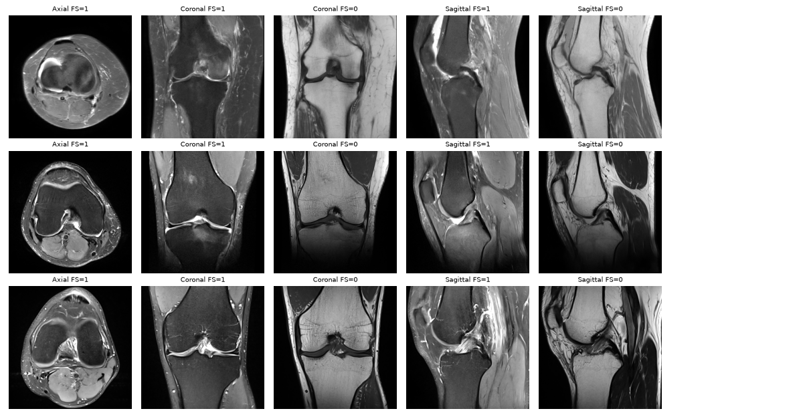

# Knee MRI Abnormality Detection · RSNA 2026

My work on the [RSNA Knee Abnormality Detection](https://www.kaggle.com/competitions/rsna-knee-abnormality-detection) Kaggle research competition:
from a knee MRI study, predict the probability of **twelve findings** (ligament and meniscus tears, osteoarthritis, effusion, synovitis, Baker's cyst, bone contusion, fracture).

| | |
|---|---|
| **Task** | Multi-label classification, 12 binary findings per study |
| **Metric** | Macro ROC AUC (mean of the 12 per-finding AUCs) |
| **Data** | 4,407 train studies · 24,371 series · ~819k DICOM slices (~500 GB) · ~1,300 hidden test studies |
| **Labels** | Only **58** studies are labelled; all 4,407 have a free-text radiology report in one of ~10 languages |
| **Submission** | Kaggle notebook, ≤ 9 h GPU, no internet, reports **not** available at test time |
| **Timeline** | 30 Jul 2026 → **22 Oct 2026** (entry/merger deadline 15 Oct) · 5 submissions/day |

## The core problem

The test set has images only, but almost all supervision lives in the reports. So the pipeline is two steps:

1. **Reports → labels.** Turn 4,349 multilingual reports into 12 soft labels (an LLM reads each report).
   The best public label sets agree with the radiologists' 58 gold labels at **~0.89 macro AUC** ([reports/eda.md](reports/eda.md)).
2. **Images → predictions.** Train image models on those soft labels and score the hidden test studies from MRI alone.

## Key findings from EDA

Full report: [reports/eda.md](reports/eda.md) (regenerate with `python src/eda.py`).

- **58 gold labels are balanced on purpose** (e.g. effusion 60%, fracture 31%), so they are a validation set, not a training set.
- **Reports are multilingual**: English 1,733 · Turkish 831 · Spanish 682 · Greek 321 · Cyrillic 220 · German 180 · Dutch 144 · Croatian/Bosnian 139 · French 81.
- **Every study has all three planes** (sagittal, coronal, axial), usually one fluid-sensitive fat-suppressed and one T1/PD series per plane.
- **Synovitis is the hardest label to read from reports** (≤ 0.79 AUC vs gold): reports rarely mention it.
- **Slices vary a lot** (local sample): 512–768 px, 0.22–0.33 mm pixels, 2.5–4 mm thick, mixed JPEG Lossless / JPEG 2000 / uncompressed transfer syntaxes.

## Leaderboard context (6 Oct 2026, 5,314 teams)

| Medal | Rank needed | Public score now |
|---|---|---|
| Gold | top 20 | ≥ 0.958 |
| Silver | top 265 | ≥ 0.945 |
| Bronze | top 531 | ≥ 0.944 (tie-heavy) |

~1,200 teams sit at exactly 0.943–0.944: forks of the public community stack.
The public 0.944 notebook is that stack blended **70/30 with one independently trained model** (0.929 alone),
so the way up is a *different* model of my own blended into the stack.

## Plan

| Stage | What | Status |
|---|---|---|
| k01 | Fork of the public 0.944 stack, as a reference submission | **0.944** public LB |
| k02 | 256 px training cache, 4 sharded CPU kernels (24,371 series, 0 errors) | done |
| k03b | My reader v1: EfficientNetV2-S, 224 px, 8 epochs, folds 0-1 | done: **0.838** gold AUC |
| k04 / k05 | Stack + v1 at weight 0.2 / v1 alone (calibrates the blend weight) | running |
| k06 | My reader v2: 256 px, 14 epochs, all 4 folds | queued |
| final | Two picks: a safe blend and a bolder one | |

## My reader (k03)

Same study-level design as the public ConvNeXt reader (Apache 2.0, credited in `src/knee.py`), trained independently so it adds diversity to the blend:

- **Preprocessing** ([src/preprocess.py](src/preprocess.py)): each series is reoriented to a canonical view, resampled to 0.6 mm pixels, centre-cropped to 153.6 mm (256 px) and capped at 32 slices.
- **Model** ([src/knee.py](src/knee.py)): a 2D backbone reads 3-slice windows (8 per series) from up to 6 series; a small transformer mixes all windows of the study; one attention pooling per finding.
- **Different from the public reader**: EfficientNetV2-S instead of ConvNeXt-Tiny, 224 px instead of 256+, and `llm_labels_v4_blend` soft labels.
- **Validation**: the 58 gold studies are never trained on; each epoch logs gold macro AUC and held-out AUC against the report labels.



### v1 results on the 58 gold studies (folds 0+1 rank-averaged)

| Finding | Model | Report labels |
|---|---|---|
| ACL | 0.864 | 0.987 |
| MCL | 0.651 | 0.968 |
| Medial Meniscus | 0.817 | 0.948 |
| Lateral Meniscus | 0.742 | 0.879 |
| Medial OA | 0.913 | 0.932 |
| Lateral OA | 0.750 | 0.833 |
| PF OA | 0.776 | 0.902 |
| Effusion | **0.986** | 0.877 |
| Synovitis | 0.753 | 0.790 |
| Baker's | **0.967** | 0.944 |
| Contusion | **0.941** | 0.860 |
| Fracture | **0.891** | 0.793 |
| **Macro** | **0.838** | **0.893** |

The image model beats its own training labels on effusion, Baker's cyst, contusion and fracture,
and is weakest on small structures (MCL, lateral meniscus): the reason v2 goes to 256 px and trains longer.
Gold AUC was still rising at the last epoch in both folds (0.66 → 0.84 over 8 epochs).

## Kernels

| Kernel | Public LB | Notes |
|---|---|---|
| [k01-public-stack-baseline](kernels/k01-public-stack-baseline) | 0.944 | unmodified fork of [goodpjw2008's 0.944 notebook](https://www.kaggle.com/code/goodpjw2008/rsna-knee-stack-2-5d-convnext-mil-lb-0-944) |

## Data

Competition data is never committed (Kaggle rules forbid redistributing it).
`data/` is a symlink to an external SSD:

```
data -> /Volumes/Aditya ssd/KAGGLE_DATA/rsna-knee-abnormality-detection
  raw/      train.csv, train_series.csv, test*.csv, sample_submission.csv
  sample/   a few full studies as DICOM, for local debugging (src/download_sample.py)
  ext/      public report-label datasets (CC0)
  cache/    public preprocessed 3D volumes (17 GB)
```

Training and submissions run on Kaggle, where the full ~500 GB is mounted; the Mac (M4, 16 GB) is for code, EDA and small experiments.

## How to run

```bash
uv venv --python 3.12 .venv && uv pip install --python .venv/bin/python -r requirements.txt
kaggle competitions download rsna-knee-abnormality-detection -f train.csv -p data/raw   # also train_series.csv, test*.csv
python src/download_sample.py --studies 5   # a few DICOM studies for local tests
python src/eda.py                           # -> reports/eda.md
```

## Repo layout

```
src/        download_sample.py, eda.py, preprocess.py, knee.py, train.py,
            make_cache_kernels.py, make_train_kernel.py
kernels/    Kaggle notebooks (each folder has kernel-metadata.json; push with `kaggle kernels push -p kernels/<name>`)
reports/    eda.md
docs/       pipeline diagram (draw.io)
```
